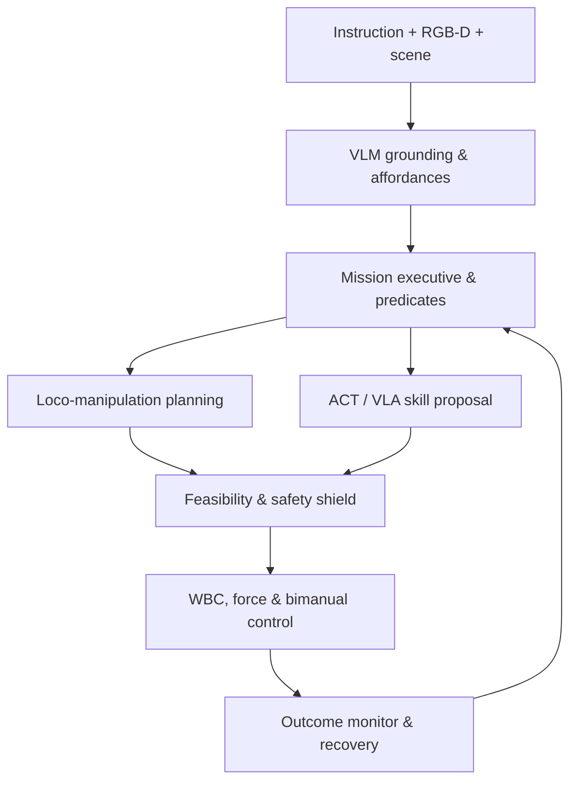

# P09 — Humanoid Bimanual Loco-Manipulation & Long-Horizon Autonomy

## 1. Thông tin project

- **Mã project:** P09
- **Tên project:** Humanoid Bimanual Loco-Manipulation & Long-Horizon Autonomy
- **Thời gian:** Tuần 61–68, từ **08/11/2027 đến 02/01/2028**
- **Hướng phát triển:** Humanoid AI Perception, VLM/VLA kết hợp Humanoid Whole-Body Control, Grasping & Simulation
- **Thành viên A:** Object/affordance perception, language grounding, demonstration data, ACT/VLA policies, failure detection và AI evaluation
- **Thành viên B:** Grasp mechanics, arm/hand planning, force control, bimanual coordination, loco-manipulation, task executive và control evaluation
- **Điểm xuất phát:** Kế thừa P03 scene/language grounding, P04 VLA skill interface, P05 3D object/human state, P06 state/contact/dynamics, P07 locomotion/WBC và P08 hardware-ready safety/runtime contracts.

## 2. Bài toán, công dụng và phạm vi

### 2.1. Project giải quyết vấn đề gì?

P09 là capstone hợp nhất: humanoid nhận chỉ dẫn ngôn ngữ, xác định đúng vật thể và affordance, đi tới vùng thao tác, lập kế hoạch dùng một hoặc hai tay, grasp/manipulate bằng position–force control, xác minh kết quả và phục hồi khi thất bại. Khác với P04 tập trung vào nền VLA, P09 buộc action của VLA đi qua toàn bộ stack vật lý đã hoàn thiện ở P05–P08.

Project không xem một chuỗi action do model sinh là kế hoạch hợp lệ. Mỗi bước phải có precondition, frame, unit, validity horizon, collision/contact/force constraints, success predicate và recovery policy. VLM/VLA đề xuất object/skill/reference; deterministic task executive, motion planner, whole-body controller và safety gateway quyết định có được thực thi hay không.

### 2.2. Công dụng trong humanoid robot

- Thực hiện nhiệm vụ “đi đến bàn, lấy vật thể, mang và đặt đúng vị trí”.
- Grounding chỉ dẫn vào object/region cụ thể trong semantic map.
- Lập kế hoạch grasp, arm trajectory và base repositioning có collision checks.
- Phối hợp hai tay để nâng/giữ/vận chuyển vật cồng kềnh.
- Dùng force/impedance cho contact-rich tasks như insertion, drawer hoặc door interaction.
- Phát hiện sai object, grasp slip, blocked path, force anomaly và task timeout để retry/replan/abort.
- Đánh giá long-horizon success thay vì chỉ đo một lần inference hoặc một grasp riêng lẻ.

### 2.3. Input tổng thể

| Input | Interface | Tần số | Frame/đơn vị |
|---|---|---:|---|
| Language instruction | `/mission/instruction`, `MissionGoal` | event | Vietnamese/English text + constraints |
| Semantic scene | P03/P05 scene graph, 3D objects, 6D poses | 5–15 Hz | `map`, covariance/confidence |
| RGB-D observations | head/wrist cameras | 15–30 Hz | calibrated optical frames |
| Robot state | P06 floating-base/contact/centroidal state | 200 Hz | `odom/base_link`, SI |
| Locomotion capability | P07 `WalkToPose` action/status | action | `map/odom` goals |
| Joint/wrench/tactile state | P06/P08 hardware contracts | 100–1000 Hz | SI + health/freshness |
| Robot/object models | URDF/SRDF, meshes, grasp metadata | versioned | links, collisions, mass/friction |
| Safety/runtime health | P08 safety/hardware/AI health | 10–500 Hz | state, reason, expiry |

### 2.4. Output tổng thể

| Output | Interface/artifact | Nội dung |
|---|---|---|
| Grounded mission | `/mission/grounded`, `GroundedMission` | object IDs, regions, ordered skills, confidence |
| Grasp candidates | `/manipulation/grasps`, `GraspCandidateArray` | hand pose, approach, width, score, collision/force metadata |
| Manipulation plan | `/manipulation/plan`, `ManipulationPlan` | base/arm/hand phases, trajectories, contacts và guards |
| Skill execution | `ExecuteSkill.action` | goal, feedback, result, reason và artifacts |
| Mission status | `/mission/status`, `MissionStatus` | active node, attempts, predicates, safety và completion |
| Dataset/model registry | manifests + registries | demonstrations, ACT/VLA adapters, metrics và hashes |
| Evidence | `docs/verification.md` | grasp, bimanual, force, VLA, recovery và long-horizon metrics |

### 2.5. Người dùng/module sử dụng kết quả

- Operator gửi nhiệm vụ và nhận trạng thái/reason/evidence.
- Mission executive gọi locomotion, perception refresh, grasp planning và manipulation skills.
- WBC/force controller nhận reference đã xác minh, không nhận raw language token.
- P08 safety gateway có quyền reject/stop mọi command bất kể mission/VLA state.
- Dataset pipeline dùng episode logs để huấn luyện và đánh giá ACT/VLA nhưng tách evaluator ground truth.

### 2.6. Phạm vi bắt buộc

- Object/affordance/region grounding và 6D pose/grasp-candidate interface.
- Contact model, force/form closure, gripper/hand geometry và grasp quality baseline.
- Arm/hand motion planning, IK, collision checking và execution monitoring.
- Whole-body mobile manipulation và bimanual load-sharing baseline.
- Position/force/impedance behavior cho ít nhất một contact-rich task.
- Demonstration episode schema, quality gates và leak-free task/object/environment splits.
- ACT-style imitation baseline và ít nhất hai VLA adapters được benchmark offline/closed-loop.
- Behavior-tree mission executive, predicates, retry/replan/abort và safety integration.
- Ba long-horizon scenarios với deterministic replay, metrics và video.

### 2.7. Ngoài phạm vi

- Không tự huấn luyện 7B VLA từ đầu; dùng pretrained/adapter/small-policy phù hợp tài nguyên.
- Không cho cloud model hoặc raw LLM output điều khiển joint/torque trực tiếp.
- Không dexterous in-hand manipulation tốc độ cao hoặc tool use nguy hiểm.
- Không full untethered hardware test nếu P08 restricted activation chưa được lab phê duyệt.
- Không dùng face recognition hoặc persistent personal identity.
- Không coi một demo thành công là bằng chứng tổng quát; phải đánh giá nhiều seed/object/layout và failure recovery.

### 2.8. Điều kiện bắt đầu

- P05 cung cấp object 6D pose/semantic map và human-aware scene state có uncertainty.
- P06/P07 cung cấp stable base/contact state, locomotion, WBC và force-control primitives.
- P08 cung cấp shadow/restricted runtime, watchdog, command expiry và release registry.
- Simulator có table, shelf, drawer/door, containers, graspable objects và reproducible physics.
- Object assets có mesh/collision/mass/friction/symmetry/license metadata.

### 2.9. Tiêu chí kết thúc

- Single-arm pick-and-place success ≥90% trên seen objects và ≥75% trên held-out object/layout set.
- Bimanual carry/place success ≥80% trong locked load/size envelope; load imbalance và slip được phát hiện.
- Contact-rich task success ≥80%; peak force, impulse và joint/torque limits không vượt gate.
- Referring-object grounding accuracy ≥90% trên unambiguous test; ambiguous instruction phải hỏi/làm rõ hoặc abort, không đoán mù.
- Long-horizon mission success ≥70% trên held-out combinations; báo cả first-attempt và after-recovery success.
- Mọi VLA action đi qua schema, feasibility, collision, force, state freshness và P08 safety checks.
- Invalid/unsafe/unknown instruction không tạo actuator command; timeout/fault có deterministic recovery hoặc safe abort.
- CI, scenario tests, model/data cards, architecture, runbook, traces và video evidence hoàn chỉnh.

### 2.10. Kế thừa và bàn giao

| Kế thừa | P09 bổ sung | Bàn giao cuối |
|---|---|---|
| P03/P04 language/VLA contracts | Grounded mission + policy adapters | Safe language-to-skill pipeline |
| P05 3D objects/scene | Affordance and grasp candidates | Manipulation-ready world model |
| P06 dynamics/contact | Grasp/contact monitoring | Contact-rich state and evidence |
| P07 locomotion/WBC | Loco-manipulation and bimanual tasks | Unified whole-body capability |
| P08 runtime/safety | Shadow/restricted execution | Reproducible capstone release |

## 3. Architecture



### 3.1. Module và failure behavior

| Module | Input | Output | Failure behavior |
|---|---|---|---|
| `grounding` | instruction + scene | object/region/skill binding | ambiguity returns clarification/abort; no guessed object ID |
| `affordance` | RGB-D, pose, object metadata | grasp/contact/use regions | low confidence requests new view or classical fallback |
| `grasping` | object/hand/contact model | feasible grasp candidates | no force/collision/reachability-valid grasp returns `NO_GRASP` |
| `planning` | base/arm/hand goals | collision-free timed plan | stale scene invalidates/replans before execution |
| `policy` | causal observations/instruction | bounded action chunks | OOD/NaN/timeout rejected; deterministic primitive fallback |
| `whole_body` | plan/reference/state/contact | safe joint/force command | infeasible drops soft tasks or safe abort; hard limits remain |
| `executive` | predicates/status/events | next skill/recovery/result | retry budget and timeout prevent infinite loops |
| `evaluation` | runtime outputs + evaluator truth | metrics/evidence | missing truth marked `not_evaluable`, not success |

### 3.2. Interface VLM/VLA ↔ Motion/Control

```yaml
topic: /mission/grounded
type: p09_interfaces/msg/GroundedMission
message:
  mission_id: mission_0042
  instruction: "Mang hộp màu đỏ từ bàn sang kệ thấp"
  target_object_id: object_17
  target_region_id: shelf_low_region_2
  ordered_skills: [NAVIGATE_PREGRASP, GRASP, LIFT, CARRY, PLACE, VERIFY]
  grounding_confidence: 0.94
  scene_version: map_031
  valid_until_ns: 74400000000
  ambiguity_status: UNAMBIGUOUS
```

```yaml
action: /manipulation/execute_skill
type: p09_interfaces/action/ExecuteSkill
goal:
  skill: GRASP
  object_id: object_17
  plan_id: grasp_plan_008
  controller_mode: WHOLE_BODY_FORCE
  max_force_n: 45.0
  timeout_s: 8.0
  safety_release: p08_safe_006
feedback:
  phase: CLOSE_AND_VERIFY
  position_error_m: 0.006
  measured_force_n: 18.4
  slip_probability: 0.03
result:
  status: SUCCEEDED
  reason: GRASP_STABLE
```

### 3.3. Trust, action và recovery policy

- Language/VLM/VLA chỉ được tham chiếu stable object/region/skill IDs; free-form output phải parse vào schema và validate.
- VLA action space được map theo robot embodiment, units, frames, rate và bounds; action chunk có expiry.
- Motion/collision/contact/force checks và P08 safety gateway là bắt buộc, không phải soft score.
- Success predicate dùng perception + state/contact evidence; model self-report không đủ để kết luận thành công.
- Retry có budget và thay đổi chiến lược có lý do; repeated same failure dẫn tới re-observe/replan hoặc safe abort.

### 3.4. Logging, configuration và testing

- Mỗi mission có `mission_id`; mỗi skill có `attempt_id`, scene/model/controller/release hashes và causal event timeline.
- Logs tách runtime observations, policy proposals, validator decisions, commands và evaluator-only outcomes.
- Unit tests kiểm tra schemas/math; integration tests kiểm tra module boundaries; system tests chạy mission matrix và injected failures.

## 4. Cấu trúc repository chuyên nghiệp

```text
p09_humanoid_bimanual_loco_manipulation_long_horizon_autonomy/
├── README.md
├── LICENSE
├── CONTRIBUTING.md
├── SECURITY.md
├── pyproject.toml
├── requirements.lock
├── CMakeLists.txt
├── .editorconfig
├── .gitignore
├── .pre-commit-config.yaml
├── .github/workflows/ci.yaml
├── docs/
│   ├── architecture.md
│   ├── interfaces.md
│   ├── task_and_skill_model.md
│   ├── grasp_and_contact_model.md
│   ├── bimanual_control.md
│   ├── vla_policy.md
│   ├── recovery_policy.md
│   ├── safety_case.md
│   ├── verification.md
│   └── runbook.md
├── configs/
│   ├── system.yaml
│   ├── objects.yaml
│   ├── grounding.yaml
│   ├── grasping.yaml
│   ├── planning.yaml
│   ├── whole_body.yaml
│   ├── force_control.yaml
│   ├── policy.yaml
│   ├── executive.yaml
│   ├── safety.yaml
│   └── simulation.yaml
├── assets/
│   ├── README.md
│   ├── object_registry.json
│   ├── scene_registry.json
│   └── grasp_metadata.yaml
├── data/
│   ├── README.md
│   ├── episode_manifest.json
│   ├── split_manifest.json
│   ├── instruction_catalog.yaml
│   └── scenario_catalog.yaml
├── models/
│   ├── README.md
│   └── registry.json
├── policies/
│   ├── README.md
│   └── registry.json
├── src/p09_core/
│   ├── __init__.py
│   ├── config.py
│   ├── contracts.py
│   ├── errors.py
│   ├── logging.py
│   ├── perception/
│   │   ├── __init__.py
│   │   ├── object_adapter.py
│   │   ├── affordance.py
│   │   ├── grasp_candidates.py
│   │   └── outcome_verifier.py
│   ├── grounding/
│   │   ├── __init__.py
│   │   ├── parser.py
│   │   ├── vlm_grounder.py
│   │   ├── ambiguity.py
│   │   └── skill_compiler.py
│   ├── planning/
│   │   ├── __init__.py
│   │   ├── grasp_planner.py
│   │   ├── arm_planner.py
│   │   ├── base_reposition.py
│   │   ├── loco_manipulation.py
│   │   └── collision.py
│   ├── control/
│   │   ├── __init__.py
│   │   ├── hand_controller.py
│   │   ├── force_impedance.py
│   │   ├── bimanual.py
│   │   ├── whole_body.py
│   │   └── execution_monitor.py
│   ├── learning/
│   │   ├── __init__.py
│   │   ├── observations.py
│   │   ├── actions.py
│   │   ├── demonstrations.py
│   │   ├── act_policy.py
│   │   ├── vla_adapter.py
│   │   ├── uncertainty.py
│   │   └── shield.py
│   ├── executive/
│   │   ├── __init__.py
│   │   ├── predicates.py
│   │   ├── behavior_tree.py
│   │   ├── recovery.py
│   │   └── mission.py
│   └── evaluation/
│       ├── __init__.py
│       ├── grounding.py
│       ├── grasping.py
│       ├── manipulation.py
│       ├── mission.py
│       └── report.py
├── ros2_ws/src/
│   ├── p09_interfaces/
│   │   ├── CMakeLists.txt
│   │   ├── package.xml
│   │   ├── msg/
│   │   │   ├── MissionGoal.msg
│   │   │   ├── GroundedMission.msg
│   │   │   ├── GraspCandidate.msg
│   │   │   ├── GraspCandidateArray.msg
│   │   │   ├── ManipulationPlan.msg
│   │   │   └── MissionStatus.msg
│   │   └── action/ExecuteSkill.action
│   ├── p09_perception/
│   │   ├── package.xml
│   │   ├── setup.py
│   │   └── p09_perception/
│   │       ├── grounding_node.py
│   │       ├── grasp_node.py
│   │       └── outcome_node.py
│   ├── p09_planning/
│   │   ├── CMakeLists.txt
│   │   ├── package.xml
│   │   ├── include/p09_planning/manipulation_planner.hpp
│   │   └── src/manipulation_planner.cpp
│   ├── p09_control/
│   │   ├── CMakeLists.txt
│   │   ├── package.xml
│   │   ├── include/p09_control/manipulation_controller.hpp
│   │   └── src/manipulation_controller.cpp
│   ├── p09_executive/
│   │   ├── package.xml
│   │   ├── setup.py
│   │   └── p09_executive/mission_node.py
│   └── p09_bringup/
│       ├── package.xml
│       └── launch/
│           ├── simulation.launch.py
│           ├── shadow.launch.py
│           └── restricted.launch.py
├── simulation/
│   ├── gazebo/
│   │   ├── manipulation_lab.sdf
│   │   ├── household_objects.sdf
│   │   └── articulated_furniture.sdf
│   └── scenarios/
│       ├── pick_place.yaml
│       ├── shelf_retrieval.yaml
│       ├── drawer_interaction.yaml
│       ├── bimanual_carry.yaml
│       ├── cluttered_rearrangement.yaml
│       ├── human_interruption.yaml
│       ├── perception_failure.yaml
│       ├── grasp_slip.yaml
│       └── long_horizon_holdout.yaml
├── tools/p09.py
├── tests/
│   ├── unit/
│   │   ├── test_contracts.py
│   │   ├── test_grounding.py
│   │   ├── test_affordance.py
│   │   ├── test_grasping.py
│   │   ├── test_planning.py
│   │   ├── test_force_control.py
│   │   ├── test_bimanual.py
│   │   ├── test_policy.py
│   │   ├── test_executive.py
│   │   └── test_safety.py
│   ├── integration/
│   │   ├── test_scene_grounding.py
│   │   ├── test_grasp_execution.py
│   │   ├── test_loco_manipulation.py
│   │   ├── test_vla_shield.py
│   │   └── test_recovery.py
│   └── system/test_missions.py
├── deployment/
│   ├── Dockerfile
│   └── compose.yaml
└── reports/releases/.gitkeep
```

### 4.1. Vai trò của toàn bộ file/folder

| Đường dẫn | Vai trò chuyên nghiệp |
|---|---|
| `README.md`, `LICENSE`, `CONTRIBUTING.md`, `SECURITY.md` | Entry point, license, contribution và security reporting. |
| `pyproject.toml`, `requirements.lock`, `CMakeLists.txt` | Python/native dependency and build definitions. |
| `.editorconfig`, `.gitignore`, `.pre-commit-config.yaml`, `.github/workflows/ci.yaml` | Formatting, exclusions, pre-commit and CI gates. |
| `docs/architecture.md`, `interfaces.md`, `task_and_skill_model.md` | Topology, contracts, skill grammar and predicates. |
| `docs/grasp_and_contact_model.md`, `bimanual_control.md` | Grasp/contact mechanics and coordinated load control. |
| `docs/vla_policy.md`, `recovery_policy.md` | Policy adapters, action semantics, retry/replan/abort. |
| `docs/safety_case.md`, `verification.md`, `runbook.md` | Hazards, evidence and operation/recovery procedures. |
| `configs/*.yaml` | Validated object, AI, planning, control, executive, safety and simulation settings. |
| `assets/README.md`, registries and metadata | External asset policy, immutable scene/object identities and grasps. |
| `data/README.md`, manifests and catalogs | Episode provenance, leak-free split, instructions and locked scenarios. |
| `models/*`, `policies/*` | Artifact retrieval/licensing and immutable model/policy versions. |
| `src/p09_core/config.py`, `contracts.py`, `errors.py`, `logging.py` | Shared configuration, schemas, failure taxonomy and logs. |
| `src/p09_core/perception/*` | P05 adapters, affordances, grasp candidates and outcome verification. |
| `src/p09_core/grounding/*` | Instruction parsing, VLM grounding, ambiguity and skill compilation. |
| `src/p09_core/planning/*` | Grasp/arm/base/loco-manipulation planning and collision checks. |
| `src/p09_core/control/*` | Hand, force/impedance, bimanual, WBC and execution monitoring. |
| `src/p09_core/learning/*` | Observation/action schemas, demonstrations, ACT/VLA, uncertainty and shield. |
| `src/p09_core/executive/*` | Predicates, behavior tree, recovery and mission lifecycle. |
| `src/p09_core/evaluation/*` | Grounding, grasp, manipulation, mission metrics and reports. |
| `p09_interfaces/msg/*`, `action/ExecuteSkill.action` | Explicit mission/grasp/plan/status and skill-execution contracts. |
| `p09_perception/*` | ROS grounding, grasp and outcome nodes. |
| `p09_planning/*`, `p09_control/*` | C++ planning/control nodes and public headers. |
| `p09_executive/mission_node.py` | Lifecycle-aware behavior-tree mission coordinator. |
| `p09_bringup/launch/*` | Simulation, shadow and P08-restricted launch profiles. |
| `simulation/gazebo/*` | Lab, object and articulated-furniture assets. |
| `simulation/scenarios/*` | Nine deterministic/holdout mission and failure scenarios. |
| `tools/p09.py` | One CLI for collect, train, plan, execute, evaluate and report. |
| `tests/unit/*` | Contract, AI, grasp, planning, control, executive and safety tests. |
| `tests/integration/*` | Scene-grounding-grasp-locomotion-policy-recovery boundaries. |
| `tests/system/test_missions.py` | End-to-end long-horizon acceptance suite. |
| `deployment/*`, `reports/releases/.gitkeep` | Reproducible runtime and release-specific evidence root. |

## 5. Backlog theo thứ tự phát triển

### [P09-I01] — Khóa mission, skill, grasp, plan và outcome contracts

- **Thực hiện:** Cả hai.
- **Mô tả:** Định nghĩa mission/skill vocabulary, object/region IDs, action schema, frames/units/rates, preconditions, success/failure predicates, timeout, retry budget và P08 safety release binding. Free-form language không được đi qua boundary này nếu chưa parse và validate.
- **Kiến thức:**
  - ROS 2 actions — [ROS 2 Jazzy action tutorial](https://docs.ros.org/en/jazzy/Tutorials/Intermediate/Writing-an-Action-Server-Client/Py.html).
  - Behavior-tree task structure — [BehaviorTree.CPP documentation](https://www.behaviortree.dev/docs/).
- **Các file thực hiện:**
  - `docs/architecture.md`, `docs/interfaces.md`, `docs/task_and_skill_model.md` — module, action and predicate contracts.
  - `src/p09_core/contracts.py` — internal typed validation.
  - `ros2_ws/src/p09_interfaces/msg/*.msg`, `action/ExecuteSkill.action` — ROS schemas.
  - `configs/system.yaml`, `configs/executive.yaml`, `configs/safety.yaml` — shared state and gates.
- **Hoàn thành khi:** messages build/round-trip; unknown object/skill/frame/unit/version rejected; raw text cannot reach controller.

### [P09-A01] — Object, affordance và grasp-region perception

- **Thực hiện:** Thành viên A.
- **Mô tả:** Chuyển P05 masks, 3D boxes và 6D poses thành manipulation object state; dự đoán handle/surface/container/openable/support affordances và candidate approach regions. Classical geometry là baseline; learned output mang confidence/OOD và không bịa geometry khi depth/pose stale.
- **Kiến thức:**
  - 3D object/6D pose — các artefact P05 đã nghiệm thu.
  - CNN/feature learning — `AI-ADL-CH01.1.pdf`–`AI-ADL-CH02.3.pdf`.
  - Grasp dataset/evaluation bổ sung — [GraspNet-1Billion](https://graspnet.net/).
- **Input mẫu:** RGB-D + object mask/pose/mesh + hand geometry.
- **Output mẫu:** object ID, affordance masks, approach vectors, grasp regions, confidence, covariance and age.
- **Các file thực hiện:**
  - `src/p09_core/perception/object_adapter.py`, `affordance.py`, `grasp_candidates.py` — manipulation scene features.
  - `configs/objects.yaml`, `configs/grasping.yaml` — class/geometry/model/fallback settings.
  - `assets/object_registry.json`, `assets/grasp_metadata.yaml` — versioned object metadata.
  - `tests/unit/test_affordance.py`, `test_grasping.py` — geometry/stale/OOD tests.
- **Hoàn thành khi:** outputs frame/time/version valid; low-quality geometry rejected; affordance metrics reported by object class.

### [P09-B01] — Grasp mechanics, contact và force/form closure

- **Thực hiện:** Thành viên B.
- **Mô tả:** Mô hình hóa contact types, friction cones, grasp map, wrench space, force/form closure và grasp quality cho one/two-hand grasps. Kiểm tra object mass/friction uncertainty và gripper width/force limits trước khi candidate được coi là mechanically feasible.
- **Kiến thức:**
  - Grasping and Manipulation — [Modern Robotics, Chapter 12](https://modernrobotics.northwestern.edu/nu-gm-book-resource/chapter-12-grasping-and-manipulation/).
  - Contact mechanics — [MIT Underactuated Robotics: Contact](https://underactuated.mit.edu/contact.html).
- **Các file thực hiện:**
  - `src/p09_core/planning/grasp_planner.py` — force/form closure and candidate scoring.
  - `src/p09_core/control/hand_controller.py` — gripper/hand width-force interface.
  - `docs/grasp_and_contact_model.md` — conventions, assumptions and uncertainty.
  - `tests/unit/test_grasping.py` — friction, closure, width, mass and invalid-contact fixtures.
- **Hoàn thành khi:** analytic fixtures pass; infeasible grasp rejected; score changes correctly under friction/mass uncertainty.

### [P09-I02] — Perception-to-grasp contract milestone

- **Thực hiện:** Cả hai.
- **Mô tả:** Ghép object/affordance output với grasp mechanics; transform candidates into exact hand/base frames and reject stale, colliding, unreachable or non-closure candidates. Ground truth remains evaluator-only.
- **Các file thực hiện:**
  - `src/p09_core/perception/grasp_candidates.py`, `planning/grasp_planner.py` — geometry-to-feasibility pipeline.
  - `ros2_ws/src/p09_perception/p09_perception/grasp_node.py` — online publication.
  - `docs/interfaces.md` — grasp schema and validity.
  - `tests/integration/test_grasp_execution.py` — transform, stale and feasibility tests.
- **Hoàn thành khi:** accepted candidates satisfy frame/reach/collision/closure gates; no-candidate returns explicit status.

### [P09-B02] — Hand calibration và deterministic grasp primitive

- **Thực hiện:** Thành viên B.
- **Mô tả:** Hiệu chỉnh wrist-to-hand/end-effector transform, joint zero, open/close width and force relationship; tạo approach–close–verify–lift–release state machine. Contact/slip/force/time guards ngăn close/lift vô điều kiện.
- **Kiến thức:**
  - Kinematics and end-effector frames — [Modern Robotics, Chapters 3–6](https://modernrobotics.northwestern.edu/nu-gm-book-resource/).
  - Force control — [Modern Robotics, Chapter 11](https://modernrobotics.northwestern.edu/nu-gm-book-resource/chapter-11-robot-control/).
- **Các file thực hiện:**
  - `src/p09_core/control/hand_controller.py`, `execution_monitor.py` — primitive and guards.
  - `configs/force_control.yaml`, `configs/grasping.yaml` — calibrated limits and phase transitions.
  - `docs/grasp_and_contact_model.md` — calibration and success predicate.
  - `tests/unit/test_force_control.py`, `test_grasping.py` — no-contact/slip/overforce/timeout tests.
- **Hoàn thành khi:** primitive repeatable; lift requires stable grasp evidence; overforce/slip triggers safe release or retreat.

### [P09-B03] — Arm motion planning, IK và collision checking

- **Thực hiện:** Thành viên B.
- **Mô tả:** Xây pregrasp, approach, retreat and place plans using MoveIt 2/OMPL or equivalent. Validate joint limits, singularity, self/environment collision, attached-object geometry and scene version; execution phải revalidate trước movement.
- **Kiến thức:**
  - Motion planning — [Modern Robotics, Chapter 10](https://modernrobotics.northwestern.edu/nu-gm-book-resource/chapter-10-motion-planning/).
  - MoveIt Task Constructor — [MoveIt 2 MTC tutorials](https://moveit.picknik.ai/main/doc/tutorials/pick_and_place_with_moveit_task_constructor/pick_and_place_with_moveit_task_constructor.html).
- **Các file thực hiện:**
  - `src/p09_core/planning/arm_planner.py`, `collision.py` — planning-scene and trajectory validation.
  - `ros2_ws/src/p09_planning/src/manipulation_planner.cpp` — MoveIt/native integration.
  - `configs/planning.yaml` — planners, budgets and constraints.
  - `tests/unit/test_planning.py` — collision, attachment, stale-scene and no-plan tests.
- **Hoàn thành khi:** plans collision-free and reproducible within seed policy; stale scene/revalidation failure prevents execution.

### [P09-A02] — Referring-object VLM grounding và ambiguity handling

- **Thực hiện:** Thành viên A.
- **Mô tả:** Ground instruction phrases into stable scene object/region IDs using rules/CLIP baseline and VLM adapter. Test color, category, spatial relations, negation and multiple similar objects; ambiguity module must request clarification or safe abort.
- **Kiến thức:**
  - CLIP — `2103.00020.pdf`.
  - Vision-language reasoning — `2301.12597.pdf`, `2303.03378.pdf`.
  - Image-text-to-text inference — [Hugging Face Transformers](https://huggingface.co/docs/transformers/tasks/image_text_to_text).
- **Input mẫu:** instruction + scene crop/object list/relations.
- **Output mẫu:** target IDs, attributes/relations evidence, confidence, ambiguity candidates and scene version.
- **Các file thực hiện:**
  - `src/p09_core/grounding/parser.py`, `vlm_grounder.py`, `ambiguity.py` — language-to-scene binding.
  - `ros2_ws/src/p09_perception/p09_perception/grounding_node.py` — ROS runtime.
  - `configs/grounding.yaml`, `data/instruction_catalog.yaml` — models/templates/test cases.
  - `tests/unit/test_grounding.py`, `tests/integration/test_scene_grounding.py` — referential/ambiguous/stale tests.
- **Hoàn thành khi:** accuracy gate met; ambiguous/unknown/negated cases handled; no invented object ID.

### [P09-I03] — Language-grounded pick-and-place

- **Thực hiện:** Cả hai.
- **Mô tả:** Compile grounded instruction into deterministic `NAVIGATE_PREGRASP → GRASP → LIFT → PLACE → VERIFY`. Integrate P07 base motion, arm planning, grasp primitive and outcome perception; every transition requires predicate evidence.
- **Các file thực hiện:**
  - `src/p09_core/grounding/skill_compiler.py`, `executive/predicates.py` — grounded skill graph.
  - `ros2_ws/src/p09_executive/p09_executive/mission_node.py` — orchestration.
  - `simulation/scenarios/pick_place.yaml`, `shelf_retrieval.yaml` — locked scenarios.
  - `tests/integration/test_scene_grounding.py`, `test_grasp_execution.py` — end-to-end grounding/execution.
- **Hoàn thành khi:** correct object picked/placed; failed predicate blocks next phase; operator receives precise failure reason.

### [P09-B04] — Whole-body mobile manipulation và base repositioning

- **Thực hiện:** Thành viên B.
- **Mô tả:** Chọn base pose/stance để tăng reachability/manipulability and stability, then coordinate P07 locomotion with arm/posture tasks. Walking and manipulation phases have explicit handoff; object load updates COM/dynamics assumptions.
- **Kiến thức:**
  - Whole-body task-space control — [TSID official repository](https://github.com/stack-of-tasks/tsid).
  - Motion planning/control — [Modern Robotics, Chapters 9–11](https://modernrobotics.northwestern.edu/nu-gm-book-resource/).
- **Các file thực hiện:**
  - `src/p09_core/planning/base_reposition.py`, `loco_manipulation.py` — stance/base/phase planning.
  - `src/p09_core/control/whole_body.py` — manipulation-aware WBC tasks.
  - `configs/whole_body.yaml`, `configs/planning.yaml` — priorities and handoff gates.
  - `tests/integration/test_loco_manipulation.py` — walk-reach-grasp-carry transitions.
- **Hoàn thành khi:** base poses reachable/stable/collision-free; load-aware limits applied; unsafe simultaneous phase rejected.

### [P09-B05] — Bimanual coordination và load sharing

- **Thực hiện:** Thành viên B.
- **Mô tả:** Xây relative hand-pose constraint, object frame, internal-force/load-sharing objectives and synchronized contact state machine. Detect asymmetric contact, slip, overconstraint and grasp loss; define safe lower/release behavior.
- **Kiến thức:**
  - Multiple contacts/force closure — [Modern Robotics, Chapter 12](https://modernrobotics.northwestern.edu/nu-gm-book-resource/chapter-12-grasping-and-manipulation/).
  - Constrained dynamics/QP — [Modern Robotics, Chapter 8](https://modernrobotics.northwestern.edu/nu-gm-book-resource/chapter-8-autoplay/).
- **Các file thực hiện:**
  - `src/p09_core/control/bimanual.py`, `whole_body.py`, `execution_monitor.py` — coordination and monitoring.
  - `docs/bimanual_control.md`, `configs/whole_body.yaml` — object/load/contact formulation.
  - `simulation/scenarios/bimanual_carry.yaml` — mass/size/friction envelope.
  - `tests/unit/test_bimanual.py` — sync/load/slip/overconstraint tests.
- **Hoàn thành khi:** load sharing within tolerance; grasp-loss detected; safe lower/release executes inside defined envelope.

### [P09-A03] — Demonstration episode schema và quality pipeline

- **Thực hiện:** Thành viên A.
- **Mô tả:** Chuẩn hóa episodes gồm synchronized images, language, robot state, actions, contacts, object/scene IDs, success/failure and provenance. Kiểm tra timestamp gaps, teleoperation interventions, action saturation, calibration/model versions and task/object/environment split leakage.
- **Kiến thức:**
  - Data preparation/evaluation — `AI-BML-CH01.1.pdf`, `AI-BML-CH01.2.pdf`.
  - Robot-learning dataset format — [LeRobot datasets documentation](https://huggingface.co/docs/lerobot/lerobot-dataset-v3).
  - Open X-Embodiment — `2310.08864.pdf`.
- **Các file thực hiện:**
  - `src/p09_core/learning/demonstrations.py`, `observations.py`, `actions.py` — episode validation and canonical schema.
  - `data/episode_manifest.json`, `split_manifest.json`, `scenario_catalog.yaml` — provenance and splits.
  - `configs/policy.yaml` — observation/action windows and units.
  - `tests/unit/test_policy.py` — time alignment, saturation, leakage and missing-field tests.
- **Hoàn thành khi:** every episode validates or has rejection reason; splits disjoint by scenario/object/layout; future information excluded.

### [P09-I04] — Bimanual demonstration collection milestone

- **Thực hiện:** Cả hai.
- **Mô tả:** Collect deterministic single-arm and bimanual expert demonstrations using planners/controllers in simulation. A validates episode quality; B validates physical feasibility/contact/force and intervention labels. Failed trajectories are retained with labels, not silently deleted.
- **Các file thực hiện:**
  - `src/p09_core/learning/demonstrations.py`, `evaluation/manipulation.py` — collection and quality report.
  - `data/episode_manifest.json`, `split_manifest.json` — accepted/rejected episodes.
  - `simulation/scenarios/pick_place.yaml`, `bimanual_carry.yaml` — expert tasks.
  - `tests/integration/test_grasp_execution.py`, `test_loco_manipulation.py` — data/action consistency.
- **Hoàn thành khi:** dataset meets coverage/quality gates; failure/intervention labels complete; exact episodes reproducible by manifest.

### [P09-A04] — ACT action-chunking imitation baseline

- **Thực hiện:** Thành viên A.
- **Mô tả:** Train ACT-style policy on validated demonstrations to predict bounded action chunks for pick/place and bimanual primitives. Compare chunk size, temporal aggregation and observation history; evaluate offline loss plus closed-loop success and compounding error.
- **Kiến thức:**
  - ACT policy — [LeRobot ACT documentation](https://huggingface.co/docs/lerobot/act).
  - Action Chunking with Transformers — [ACT paper](https://arxiv.org/abs/2304.13705).
- **Các file thực hiện:**
  - `src/p09_core/learning/act_policy.py`, `observations.py`, `actions.py` — training/inference adapter.
  - `configs/policy.yaml`, `policies/registry.json` — hyperparameters, bounds and model version.
  - `src/p09_core/evaluation/manipulation.py` — offline/closed-loop metrics.
  - `tests/unit/test_policy.py` — chunk shape, causal window, bounds and deterministic inference.
- **Hoàn thành khi:** held-out closed-loop success reported; actions bounded/causal; classical primitive fallback remains available.

### [P09-B06] — Contact-rich force/impedance manipulation

- **Thực hiện:** Thành viên B.
- **Mô tả:** Triển khai hybrid position–force/impedance primitive cho drawer or constrained insertion. Define contact direction, force target, compliance, approach/search/insert/retreat phases and force/energy/timeout guards.
- **Kiến thức:**
  - Force and hybrid motion-force control — [Modern Robotics, Chapter 11](https://modernrobotics.northwestern.edu/nu-gm-book-resource/chapter-11-robot-control/).
  - Contact dynamics — [MIT Underactuated: Contact](https://underactuated.mit.edu/contact.html).
- **Các file thực hiện:**
  - `src/p09_core/control/force_impedance.py`, `execution_monitor.py` — contact-rich primitive and guards.
  - `configs/force_control.yaml` — axes, gains, limits and phases.
  - `simulation/gazebo/articulated_furniture.sdf`, `scenarios/drawer_interaction.yaml` — task plant.
  - `tests/unit/test_force_control.py`, `tests/integration/test_grasp_execution.py` — contact/loss/jam/overforce tests.
- **Hoàn thành khi:** success/force gates achieved; jam/contact-loss produces retreat/abort; no hard limit violation.

### [P09-A05] — VLA adapter benchmark: SmolVLA, OpenVLA và Octo

- **Thực hiện:** Thành viên A.
- **Mô tả:** Tạo common observation/action adapter and benchmark at least two feasible VLA families; SmolVLA is preferred for local resource constraints, while OpenVLA/Octo can be offline/reference. Map each action convention to robot frames/units/bounds and report latency, memory, success, OOD and embodiment mismatch.
- **Kiến thức:**
  - SmolVLA — [LeRobot SmolVLA documentation](https://huggingface.co/docs/lerobot/smolvla).
  - OpenVLA — `2406.09246.pdf`, [official project](https://openvla.github.io/).
  - Octo — `2405.12213.pdf`.
  - Open X-Embodiment — `2310.08864.pdf`.
- **Các file thực hiện:**
  - `src/p09_core/learning/vla_adapter.py`, `observations.py`, `actions.py`, `uncertainty.py` — normalized adapters and health.
  - `configs/policy.yaml`, `models/registry.json`, `policies/registry.json` — exact model/action versions.
  - `src/p09_core/evaluation/manipulation.py`, `report.py` — comparative evaluation.
  - `tests/unit/test_policy.py` — embodiment/frame/unit/bound/timeout/OOD tests.
- **Hoàn thành khi:** at least two adapters evaluated under same protocol; mismatched embodiment/version blocked; no raw action bypasses validation.

### [P09-B07] — Loco-manipulation plan và dynamic task transition

- **Thực hiện:** Thành viên B.
- **Mô tả:** Compose navigation, stance selection, reach, grasp, carry and place while maintaining support/contact/load constraints. Replan base/feet/arms when scene or object pose changes; prohibit walking with object outside approved load/grasp envelope.
- **Kiến thức:**
  - Motion planning and trajectory generation — [Modern Robotics, Chapters 9–10](https://modernrobotics.northwestern.edu/nu-gm-book-resource/).
  - Whole-body control — [TSID](https://github.com/stack-of-tasks/tsid).
- **Các file thực hiện:**
  - `src/p09_core/planning/loco_manipulation.py`, `base_reposition.py`, `arm_planner.py` — composite planner.
  - `src/p09_core/control/whole_body.py`, `bimanual.py` — load-aware execution.
  - `configs/planning.yaml`, `whole_body.yaml` — handoff and load envelope.
  - `tests/integration/test_loco_manipulation.py` — motion/object/scene-change tests.
- **Hoàn thành khi:** composite plan transitions valid; object/load integrated into collision/stability; unsafe carry rejected.

### [P09-I05] — Shielded VLA skill execution

- **Thực hiện:** Cả hai.
- **Mô tả:** Route ACT/VLA action chunks through schema, freshness/OOD, kinematic/collision/contact/force checks, WBC and P08 safety gateway. Compare deterministic primitive, ACT and VLA under identical scenarios; policy timeout or invalid output falls back or aborts predictably.
- **Các file thực hiện:**
  - `src/p09_core/learning/shield.py`, `uncertainty.py` — policy validation/projection.
  - `ros2_ws/src/p09_control/src/manipulation_controller.cpp` — shielded reference execution.
  - `docs/vla_policy.md`, `docs/safety_case.md` — boundaries and fallback matrix.
  - `tests/integration/test_vla_shield.py` — unsafe/late/OOD/frame-mismatch actions.
- **Hoàn thành khi:** policy never writes actuator command directly; invalid action rejected within one cycle; deterministic fallback/abort evidence exists.

### [P09-B08] — Behavior-tree mission executive

- **Thực hiện:** Thành viên B.
- **Mô tả:** Implement behavior tree or equivalent explicit state machine with predicates, timeouts, retries, preemption and compensation actions. Nodes call ROS actions/services and persist causal mission state; restart cannot repeat dangerous action without reconciliation.
- **Kiến thức:**
  - BehaviorTree.CPP — [official documentation](https://www.behaviortree.dev/docs/).
  - ROS 2 actions/lifecycle — [ROS 2 Jazzy documentation](https://docs.ros.org/en/jazzy/).
- **Các file thực hiện:**
  - `src/p09_core/executive/predicates.py`, `behavior_tree.py`, `mission.py` — mission engine.
  - `ros2_ws/src/p09_executive/p09_executive/mission_node.py` — ROS coordinator.
  - `configs/executive.yaml`, `docs/task_and_skill_model.md` — tree, budgets and semantics.
  - `tests/unit/test_executive.py` — timeout/retry/preempt/restart/idempotency tests.
- **Hoàn thành khi:** no infinite retry; preemption and restart safe; mission timeline and precise result reasons emitted.

### [P09-A06] — Outcome/failure detection và uncertainty-aware recovery signal

- **Thực hiện:** Thành viên A.
- **Mô tả:** Detect wrong object, missed grasp, slip, dropped object, failed placement, blocked view/path and goal-state mismatch from perception/contact/execution signals. Calibrate uncertainty and expose failure class/evidence; do not let VLM verbal confidence replace physical predicates.
- **Kiến thức:**
  - Classification/evaluation — `AI-BML-CH01.2.pdf`, `AI-BML-CH04.1.pdf`, `AI-BML-CH04.2.pdf`.
  - HMM/temporal states — `AI-AML-CH01.1.pdf`, `AI-AML-CH01.2.pdf`.
  - RNN temporal modeling — `AI-ADL-CH03.1.pdf`–`AI-ADL-CH03.3.pdf`.
- **Các file thực hiện:**
  - `src/p09_core/perception/outcome_verifier.py`, `learning/uncertainty.py` — physical/learned outcome evidence.
  - `ros2_ws/src/p09_perception/p09_perception/outcome_node.py` — ROS status.
  - `configs/executive.yaml`, `configs/safety.yaml` — failure thresholds and policy.
  - `tests/unit/test_policy.py`, `test_executive.py`, `tests/integration/test_recovery.py` — false-success/occlusion/slip tests.
- **Hoàn thành khi:** critical failure recall gate met; unknown evidence not marked success; calibrated signal drives deterministic recovery selection.

### [P09-B09] — Reactive replanning, recovery và safe abort

- **Thực hiện:** Thành viên B.
- **Mô tả:** Define recovery tree: re-observe, alternate grasp, base reposition, trajectory replan, controlled lower/release, clear workspace and safe abort. Recovery uses updated scene/contact state, has attempt/force/time budgets and never retries identical invalid plan blindly.
- **Kiến thức:**
  - Motion replanning — [MoveIt 2 Planning Scene Monitor](https://moveit.picknik.ai/main/doc/examples/planning_scene_monitor/planning_scene_monitor_tutorial.html).
  - Behavior-tree recovery — [BehaviorTree.CPP documentation](https://www.behaviortree.dev/docs/).
- **Các file thực hiện:**
  - `src/p09_core/executive/recovery.py`, `predicates.py`, `planning/collision.py` — recovery decisions and revalidation.
  - `docs/recovery_policy.md`, `configs/executive.yaml` — budgets and abort conditions.
  - `simulation/scenarios/perception_failure.yaml`, `grasp_slip.yaml`, `human_interruption.yaml` — failures.
  - `tests/integration/test_recovery.py` — reobserve/regrasp/replan/lower/abort paths.
- **Hoàn thành khi:** each failure maps to bounded recovery/abort; changed evidence required before retry; P08 stop always preempts recovery.

### [P09-I06] — Long-horizon autonomy release candidate

- **Thực hiện:** Cả hai.
- **Mô tả:** Run multi-step missions combining navigation, single/bimanual grasp, carry, contact-rich interaction, verification and recovery. Freeze scene/model/policy/controller/safety versions; evaluate first-attempt and recovered success, interventions, latency and safety events.
- **Các file thực hiện:**
  - `src/p09_core/executive/mission.py`, `evaluation/mission.py`, `report.py` — RC orchestration and metrics.
  - `simulation/scenarios/cluttered_rearrangement.yaml`, `long_horizon_holdout.yaml` — mission sets.
  - `policies/registry.json`, `models/registry.json` — frozen candidate artifacts.
  - `tests/system/test_missions.py` — end-to-end RC gate.
- **Hoàn thành khi:** long-horizon gates met on holdout; version set immutable; all failures/interventions/safety events traceable.

### [P09-A07] — Final AI grounding, policy và recovery benchmark

- **Thực hiện:** Thành viên A.
- **Mô tả:** Report grounding/ambiguity, affordance/grasp proposal, ACT/VLA policy, outcome/failure detection, calibration/OOD, latency/memory and ablations. Separate offline action error from closed-loop task success and long-horizon mission success.
- **Kiến thức:**
  - Model evaluation — `AI-BML-CH01.2.pdf`.
  - VLA references — `2212.06817.pdf`, `rt2(1).pdf`, `2310.08864.pdf`, `2405.12213.pdf`, `2406.09246.pdf`, `pi0.pdf`.
  - Responsible evaluation — `AI-GenAI-CH04.1.pdf`–`AI-GenAI-CH05.2.pdf`.
- **Các file thực hiện:**
  - `src/p09_core/evaluation/grounding.py`, `grasping.py`, `manipulation.py`, `mission.py`, `report.py` — final metrics.
  - `docs/vla_policy.md`, `docs/verification.md`, `docs/safety_case.md` — model cards, failures and limits.
  - `models/registry.json`, `policies/registry.json` — final disposition.
  - `tests/system/test_missions.py` — AI acceptance matrix.
- **Hoàn thành khi:** every model has provenance/status/fallback; no success claim based only on offline loss; failure/OOD evidence complete.

### [P09-B10] — Final grasping, bimanual và loco-manipulation control benchmark

- **Thực hiện:** Thành viên B.
- **Mô tả:** Benchmark grasp mechanics, planning, trajectory execution, force/contact, bimanual load sharing, WBC, loco-manipulation and recovery. Report collision/limit margins, force/impulse, slip/drop, plan/solve latency, execution error and safe-abort behavior.
- **Kiến thức:**
  - Modern Robotics Chapters 8–12 — [official course resources](https://modernrobotics.northwestern.edu/nu-gm-book-resource/).
  - MoveIt 2, TSID and P06–P08 control/safety artifacts.
- **Các file thực hiện:**
  - `src/p09_core/evaluation/grasping.py`, `manipulation.py`, `mission.py`, `report.py` — control metrics.
  - `docs/grasp_and_contact_model.md`, `bimanual_control.md`, `verification.md`, `runbook.md` — evidence and procedures.
  - `tests/system/test_missions.py` — final control/recovery gates.
- **Hoàn thành khi:** all physical/constraint/timing gates pass; safe abort works under injected faults; benchmark reproducible.

### [P09-I07] — Final capstone release

- **Thực hiện:** Cả hai.
- **Mô tả:** Package one-command simulation demo, P08-compatible shadow/restricted profiles, manifests, traces, reports and videos. Demonstrate language-grounded pick/place, bimanual carry and contact-rich mission with at least one injected failure/recovery; document residual risks and next steps.
- **Các file thực hiện:**
  - `README.md`, `SECURITY.md`, `docs/architecture.md`, `docs/interfaces.md`, `docs/verification.md`, `docs/runbook.md` — release documentation.
  - `tools/p09.py`, `deployment/Dockerfile`, `deployment/compose.yaml` — reproducible CLI/runtime.
  - `.github/workflows/ci.yaml`, `tests/system/test_missions.py` — final gates.
  - `reports/releases/.gitkeep` — destination for versioned evidence bundles.
- **Hoàn thành khi:** all mandatory DoD pass; fresh clone reproduces demo/report; P08 safety/shadow/rollback integration and three mission demos pass.

## 6. Lịch tuần 61–68

| Tuần | Thời gian | Kiến thức cần hoàn thành | Thành viên A | Thành viên B | Tích hợp/Deliverable | Giờ dự kiến |
|---:|---|---|---|---|---|---|
| 61 | 08/11–14/11/2027 | Contracts, affordances, grasp/contact mechanics | A01 | B01 | I01, I02; manipulation-ready scene and grasps | A: 24h, B: 26h |
| 62 | 15/11–21/11/2027 | Hand calibration, grasp primitive, arm planning, VLM grounding | A02 | B02, B03 | I03; language-grounded pick/place | A: 26h, B: 30h |
| 63 | 22/11–28/11/2027 | Whole-body mobile manipulation, bimanual control, episode schema | A03 | B04, B05 | I04; validated expert demonstrations | A: 24h, B: 30h |
| 64 | 29/11–05/12/2027 | ACT imitation and contact-rich force control | A04 | B06 | ACT baseline + drawer/contact primitive | A: 28h, B: 26h |
| 65 | 06/12–12/12/2027 | SmolVLA/OpenVLA/Octo adapters and loco-manipulation | A05 | B07 | I05; shielded VLA skill execution | A: 30h, B: 28h |
| 66 | 13/12–19/12/2027 | Mission executive, failure detection and recovery | A06 | B08, B09 | Recovery-complete mission graph | A: 26h, B: 30h |
| 67 | 20/12–26/12/2027 | Long-horizon holdout and frozen release candidate | A06 support | B09 support | I06; long-horizon RC | A: 22h, B: 22h |
| 68 | 27/12/2027–02/01/2028 | Final AI/control benchmarks and capstone release | A07 | B10 | I07; P09 release | A: 28h, B: 28h |

### Điều kiện chuyển tuần

- Sang tuần 62: contracts build; perception-to-grasp candidates meet feasibility/validity gates.
- Sang tuần 63: grounded pick/place and ambiguity handling pass; no raw language-to-control path.
- Sang tuần 64: mobile/bimanual controllers produce physically valid demonstrations with clean splits.
- Sang tuần 65: ACT and contact-rich primitive pass closed-loop/safety baseline.
- Sang tuần 66: at least two VLA adapters pass schema/shield tests; loco-manipulation transitions valid.
- Sang tuần 67: mission executive and bounded recovery matrix pass.
- Sang tuần 68: holdout long-horizon RC meets success/safety/traceability gates.
- Kết thúc P09: I07 và toàn bộ Definition of Done pass.

## 7. Test scenarios bắt buộc

| Scenario | Điều kiện | Kết quả mong đợi |
|---|---|---|
| Grounded pick/place | Similar objects/colors | Correct target or clarification; successful placement |
| Shelf retrieval | Reach/base reposition needed | Collision-free stance/arm plan and stable grasp |
| Drawer/contact task | Contact and friction variation | Force-limited success or guarded retreat |
| Bimanual carry | Mass/size within envelope | Stable load sharing, no drop/collision |
| Clutter rearrangement | Dynamic scene version | Revalidation/replan before motion |
| Human interruption | Person enters workspace | P08/P07 safety preemption and bounded stop |
| Perception failure | Occlusion/stale/wrong pose | Re-observe or safe abort; no fake success |
| Grasp slip | Friction/load perturbation | Slip detection, regrasp/lower/abort |
| VLA invalid action | NaN/frame/unit/bound/timeout | Shield rejection and deterministic fallback |
| Policy OOD | Unseen object/layout/instruction | Low confidence/clarification/fallback |
| Mission restart | Process restart mid-task | State reconciliation; no repeated hazardous action |
| Long-horizon holdout | Novel task/object/layout mix | Full success/recovery/intervention metrics |

## 8. Bảng truy vết nguồn và nhiệm vụ

| Nguồn | Kiến thức | Task | Thành viên | Sản phẩm |
|---|---|---|---|---|
| `AI-BML-CH01.1.pdf`, `AI-BML-CH01.2.pdf` | Data/evaluation | A03, A06, A07 | A | Dataset and benchmark |
| `AI-BML-CH04.1.pdf`, `AI-BML-CH04.2.pdf` | Failure classification | A06 | A | Outcome monitor |
| `AI-AML-CH01.1.pdf`, `AI-AML-CH01.2.pdf` | Temporal/HMM state | A06 | A | Failure-state inference |
| `AI-ADL-CH01.1.pdf`–`CH02.3.pdf` | CNN/features | A01 | A | Affordance model |
| `AI-ADL-CH03.1.pdf`–`CH03.3.pdf` | Temporal models | A06 | A | Outcome sequence model |
| `2103.00020.pdf` | CLIP | A02 | A | Referring-object baseline |
| `2301.12597.pdf`, `2303.03378.pdf` | Vision-language reasoning | A02 | A | VLM grounder |
| HF image-text-to-text | VLM inference | A02 | A | Runtime adapter |
| Open X `2310.08864.pdf` + LeRobot datasets | Robot episode data | A03, A05 | A | Canonical dataset/action mappings |
| LeRobot ACT | Action chunking | A04 | A | ACT policy |
| SmolVLA docs | Small VLA | A05 | A | Local VLA adapter |
| OpenVLA `2406.09246.pdf` + project | VLA | A05, A07 | A | OpenVLA benchmark |
| Octo `2405.12213.pdf` | Generalist robot policy | A05, A07 | A | Octo reference |
| RT-1 `2212.06817.pdf`, `rt2(1).pdf`, `pi0.pdf` | VLA development context | A07 | A | Comparative analysis |
| `AI-GenAI-CH04.1.pdf`–`CH05.2.pdf` | Responsible evaluation | A07 | A | Safety/model cards |
| GraspNet | Grasp data/evaluation | A01 | A | Grasp proposal baseline |
| Modern Robotics Ch.12 | Grasp/contact/closure | B01, B05, B10 | B | Grasp/bimanual mechanics |
| Modern Robotics Ch.3–6 | Frames/kinematics/IK | B02 | B | Hand calibration/primitive |
| Modern Robotics Ch.9–11 | Planning/control/force | B03, B04, B06, B07 | B | Manipulation stack |
| MoveIt Task Constructor/Planning Scene | Pick/place/replanning | B03, B09 | B | Arm planner/recovery |
| TSID | Whole-body inverse dynamics | B04, B07 | B | Loco-manipulation WBC |
| MIT Underactuated Contact | Contact-rich dynamics | B01, B06 | B | Force/contact control |
| BehaviorTree.CPP + ROS 2 actions | Mission/recovery | I01, B08, B09 | Both/B | Mission executive |
| P05–P08 artifacts | Scene/state/locomotion/runtime/safety | I01–I07 | Both | Integrated capstone |

### 8.1. Nguồn ngoài phạm vi

- Các PDF VLM/VLA còn lại chỉ được dùng khi xác định chắc nội dung; không ép mọi paper vào P09 nếu trùng hoặc không liên quan trực tiếp.
- P09 không dạy lại sensor calibration, SLAM, state estimation, locomotion và real-time deployment; các phần đó được kế thừa từ P05–P08.

## 9. Phân loại backlog

- **Bắt buộc:** I01–I07, A01–A03, A06–A07, B01–B10.
- **Nâng cao:** A04 ACT, A05 multi-VLA adapters, bimanual carry and contact-rich drawer task.
- **Tùy chọn:** dexterous hand, tool use, deformable objects, multi-contact kneeling and real-hardware restricted manipulation.
- **Không tự động thực hiện:** high-energy hardware trial, sharp/hot/heavy object manipulation or operation around unprotected people.

## 10. Definition of Done

- [ ] I01–I07, required A/B tasks completed in dependency order.
- [ ] Grounding returns valid object/region IDs or clarification/abort; never invented target.
- [ ] Grasp candidates satisfy reachability, collision, closure, force and freshness constraints.
- [ ] Single-arm, bimanual, contact-rich and loco-manipulation metrics meet gates.
- [ ] Demonstration splits are leak-free; actions are causal, framed, unit-correct and bounded.
- [ ] ACT/VLA outputs pass schema, uncertainty, feasibility, WBC and P08 safety shield.
- [ ] Mission executive enforces predicates, timeouts, retry budgets, preemption and safe abort.
- [ ] Outcome verification uses physical/perception evidence, not policy self-report alone.
- [ ] Long-horizon holdout reports first-attempt, recovered success, interventions and safety events.
- [ ] Ground truth/evaluator data cannot enter runtime policy/controller observations.
- [ ] Unit, integration and system tests pass in CI; versions/checksums are reproducible.
- [ ] Architecture, interfaces, task model, grasp/contact, bimanual, VLA, recovery, safety, verification and runbook docs complete.
- [ ] Three capstone demos and one injected-failure recovery are recorded with exact artifact hashes.
- [ ] Default hardware profile remains simulation/shadow unless P08 restricted activation is explicitly authorized.

## 11. Lệnh nghiệm thu dự kiến

```bash
colcon build --symlink-install --base-paths ros2_ws/src
pytest -q tests/unit tests/integration tests/system
python tools/p09.py evaluate --scenario-catalog data/scenario_catalog.yaml
python tools/p09.py report --output docs/verification.md
```
